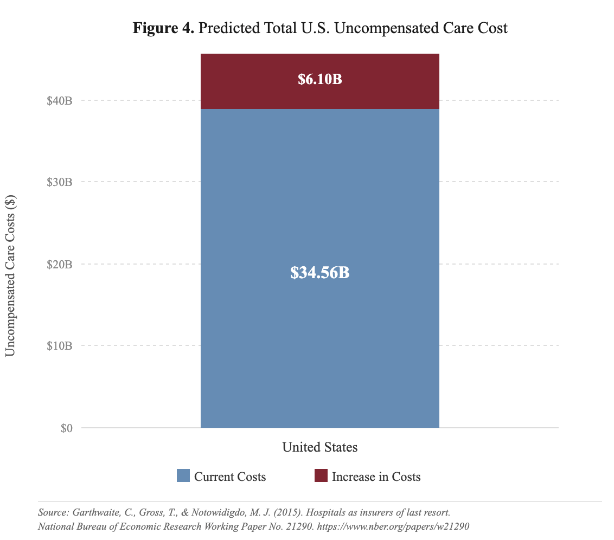
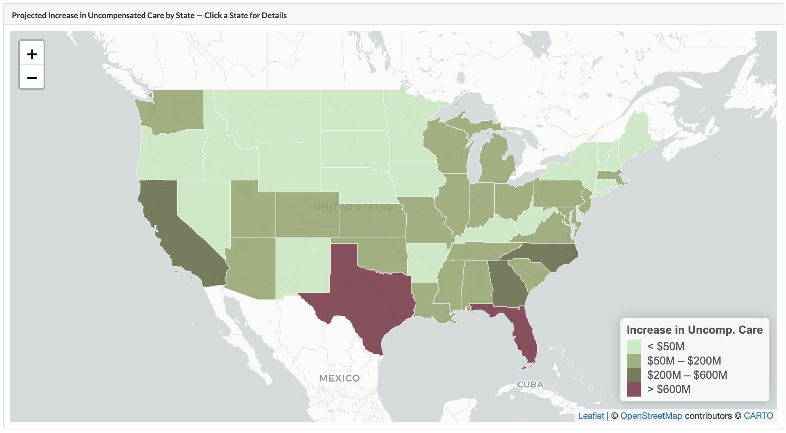
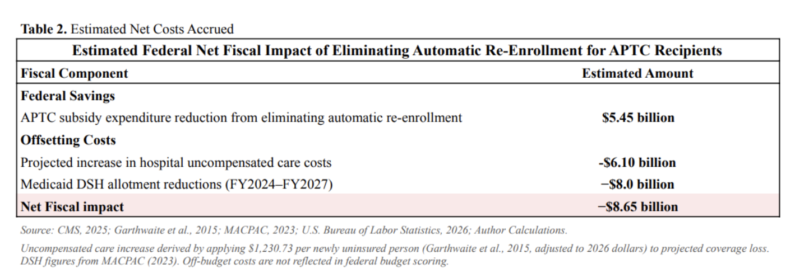

```{r setup, include=FALSE}
knitr::opts_chunk$set(echo = FALSE)
```

A selection of graduate-level work spanning health policy analysis, community-based research, and applied data science.

---

# The Hidden Cost of Eliminaitng APTC Auto Re-enrollment: ACA Marketplace Auto Re-enrollment

**Capstone in Advanced Health Policy Analysis: Emory Rollins School of Public Health ·**

For our capstone, my team analyzed Section 112201 of the One Big Beautiful Bill Act, which would eliminate automatic re-enrollment for ACA Marketplace APTC recipients beginning in 2028. My role focused on the fiscal impact — modeling what happens to hospital uncompensated care costs when people lose coverage due to an administrative barrier.

I built a state-by-state model using an inflation-adjusted per-person uncompensated care estimate ($1,230.73 in 2026 dollars) applied to projected coverage losses in each state. I also analyzed the DSH payment structure to show how concurrent Medicaid allotment reductions compound the burden on safety-net hospitals. The full picture: $5.45B in projected subsidy savings, offset by $6.10B in additional uncompensated care and $8.0B in DSH reductions — a net federal loss of $8.65 billion.

```{r bar}

```

*Baseline uncompensated care ($34.56B) plus projected increase ($6.10B). Source: CMS, 2025; Author calculations.*

```{r map}

```

*State-level projected increases. Texas and Florida face the largest absolute burdens (>$600M each).*

```{r table}

```

*Net fiscal impact. Off-budget costs not reflected in federal scoring. Source: CMS, 2025; Garthwaite et al., 2015; MACPAC, 2023; BLS, 2026.*

---

# FQHCs & Preventive Care Utilization in Georgia

**Community Engagement Project: Partnership for Southern Equity** 

I designed and conducted this project independently to examine why preventive care utilization at Federally Qualified Health Centers remains low across Georgia. Using HRSA administrative data, GIS mapping, and an original community survey I developed and fielded, I found that awareness — not geography or cost — was the dominant barrier. 100% of surveyed residents had never used an FQHC, and 100% did not know where their nearest one was located. As a deliverable, I created a publicly accessible directory of all Georgia FQHCs.

[Read Full Project (PDF)](Commuinity%20Engagement%20Project%20(FQHCs).pdf)

---

# Improving Lead Screening Mandates for Children Ages 1–3 in Georgia

**Policy Analysis: Emory Rollins School of Public Health **

I authored this policy analysis to evaluate the public health and economic case for expanding childhood blood lead screening in Georgia from its current targeted system (30% coverage) to a universal mandate modeled after New Jersey (80% coverage). Using state population data, EBLL surveillance estimates, and a $30 per-test cost, I projected 185,000 additional screenings identifying ~7,030 additional children with elevated blood lead levels annually at a cost of $5.55M with estimated economic benefits of $35M–$210M per year.

[Read Full Paper (PDF)](Policy%20Analysis%20Final.pdf)
